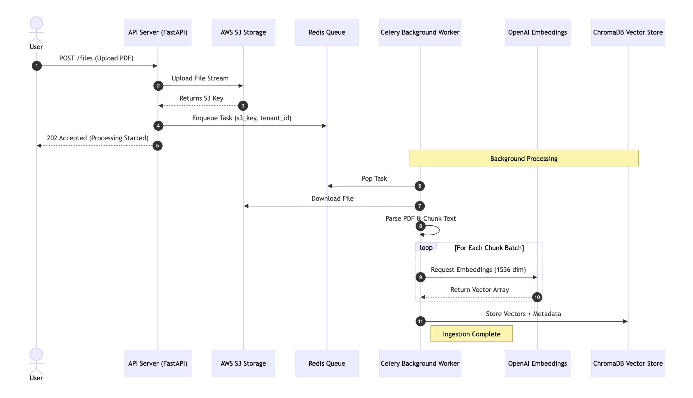
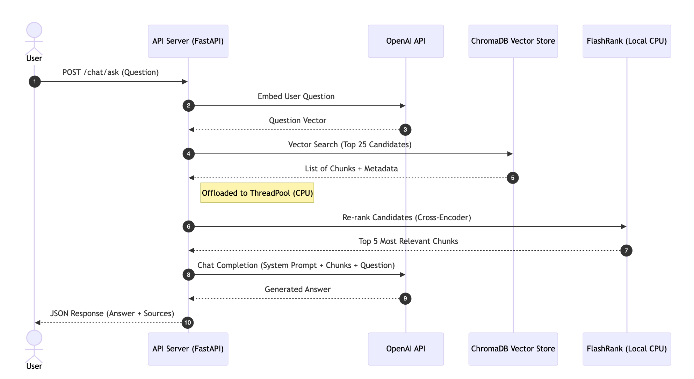

# PolicyChatbot RAG

High-performance RAG (Retrieval-Augmented Generation) pipeline designed for scalability, concurrency, and reliability.

## Upload Architecture


## Retrieval Architecture


## 🚀 Architecture & Scalability

This project is built to handle high-load production scenarios using an **Event-Driven, Asynchronous Architecture**.

### 1. Asynchronous API (FastAPI)
-   **Non-Blocking I/O**: The Chat API (`/chat/ask`) is fully `async`. It handles thousands of concurrent connections by offloading I/O (OpenAI calls) and CPU-bound tasks (Re-ranking) to background threads.
-   **Global Client Management**: Heavy clients (OpenAI, ChromaDB) are initialized **once** at startup (Singleton Pattern) via `lifespan` events, eliminating connection overhead per request.

### 2. Distributed Ingestion (Celery + Redis)
-   **Decoupled Processing**: File uploads are instant. The heavy lifting (PDF parsing, Chunking, Embedding) is offloaded to a **Redis Queue**.
-   **Horizontal Scaling**: You can spin up **100s of Celery Workers** across multiple servers to consume the queue in parallel.
-   **Fault Tolerance**: Tasks are persisted in Redis. If a worker crashes, the task is automatically re-queued.

### 3. Advanced Retrieval
-   **Hybrid Search**: Uses **ChromaDB** (Vector Search) for recall and **FlashRank** (Cross-Encoder) for high-precision re-ranking.
-   **Recursive Chunking**: Smart text splitting respects document structure for better context.

## 🛠️ Technology Stack
-   **Framework**: FastAPI (Python 3.11+)
-   **Queue**: Redis + Celery
-   **Vector DB**: ChromaDB (Cloud/Local)
-   **LLM**: OpenAI (GPT-4o / Embedding-3-small)
-   **Storage**: AWS S3

## ⚡ Quick Start

### Prerequisites
-   Python 3.11+
-   Redis (`brew install redis`)
-   Dimensions: **1536** (OpenAI Small)

### Installation
```bash
python -m venv .venv
source .venv/bin/activate
pip install -r requirements.txt
```

### Environment Variables (.env)
```ini
OPENAI_API_KEY=sk-...
CHROMA_API_KEY=...
CHROMA_TENANT=...
CHROMA_DATABASE=...
REDIS_URL=redis://localhost:6379/0
AWS_ACCESS_KEY_ID=...
AWS_SECRET_ACCESS_KEY=...
```

### Running the System
You need **3 Terminal Tabs**:

**1. Start Redis**
```bash
redis-server
```

**2. Start API Server**
```bash
uvicorn app.main:app --reload --port 8009
```

**3. Start Celery Worker**
```bash
celery -A app.worker.celery_app worker --loglevel=info
```

## 📚 API Guidelines

**Chat Endpoint**
-   **URL**: `POST /chat/ask`
-   **Body**: JSON (Not Query Params!)
```json
{
  "user_id": "user123",
  "tenant_id": "tenant-A",
  "question": "What is the policy?"
}
```